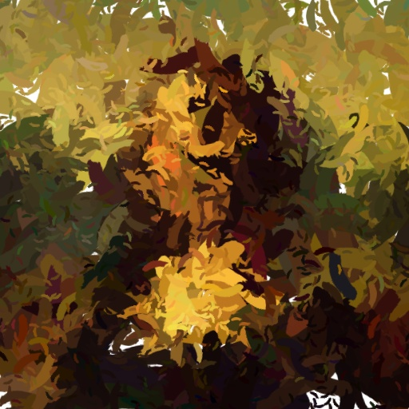

## 🎨 Эволюционное Генеративное Искусство: Имитация живописи мазками (BrushStrokeEA)

### **Обзор проекта**
Этот проект представляет собой реализацию **Эволюционного Алгоритма (ЭА)** для **генерации стилизованных изображений**, имитирующих ручную живопись с помощью дискретных мазков. В отличие от традиционных моделей переноса стиля (Style Transfer), данный подход генерирует изображение **с нуля**, используя популяцию «художников» (наборов мазков), которые эволюционируют для минимизации ошибки относительно целевого изображения.

Проект демонстрирует применение методов **Биоинспирированных вычислений** и **Компьютерного зрения** для решения задач генеративного дизайна.

---
<p align="center">
  
  <h3 align="center">Работа Эволюционного Алгоритма</h3>
  <hr>

  <a href="input3.jpg" target="_blank">
    
  </a>
    
  <a href="run_example/NameSurnameAnimation3_1.gif" target="_blank">
    
  </a>

  <a href="run_example/temp_phase3.jpg" target="_blank">
    
  </a>

  ---

### **🧠 Техническая реализация и архитектура**

Решение построено на архитектуре **Multi-Resolution Evolutionary Algorithm (MREA)**, сочетающей глобальную оптимизацию на низком разрешении с последующей детализацией.

#### **1. Хромосома и Мазок (Индивид)**

Каждая **хромосома** в популяции представляет собой **набор мазков** (`np.ndarray`). Каждый мазок (ген) параметризован 8 ключевыми характеристиками:

|**Индекс**|**Параметр**|**Диапазон**|**Назначение**|
|---|---|---|---|
|**0, 1**|X, Y|[0, Resolution]|**Координаты центра мазка**|
|**2, 3, 4**|R, G, B|[0, 255]|**Цвет мазка**|
|**5**|Size|[0.5, Max Size]|**Размер мазка**|
|**6**|Rotation|[0, 360]|**Угол поворота мазка**|
|**7**|Alpha|[50, 255]|**Прозрачность мазка**|

#### **2. Multi-Resolution Pipeline (Конвейер многоуровневого разрешения)**

Процесс генерации делится на фазы, что значительно повышает **скорость сходимости** и **качество результата**, последовательно создавая:

1. **Фаза 1 (128x128):** Формирование **общей цветовой гаммы и базовой формы**.
    
2. **Фаза 2 (256x256):** Проработка **основной структуры и композиции**.
    
3. **Фаза 3 (512x512):** Добавление **мелких деталей и финишная доводка**.
    

На каждой новой фазе все существующие мазки **автоматически масштабируются** (`upscale_strokes`) к новому разрешению, сохраняя относительное положение.

#### **3. Адаптивная Функция Приспособленности (Fitness Function)**

Для оценки качества сгенерированного изображения использована комплексная функция приспособленности, включающая несколько метрик для обеспечения как **цветового соответствия**, так и **структурного сходства**:

$$\text{Fitness} = w_{\text{MSE}} \cdot \text{MSE} + w_{\text{Hist}} \cdot \text{HistDiff} + w_{\text{Edge}} \cdot \text{EdgeDiff} + w_{\text{SSIM}} \cdot \text{SSIMDissim}$$

- **$\text{MSE}$ (Среднеквадратичная ошибка):** Базовое цветовое отличие.
    
- **$\text{HistDiff}$ (Разница гистограмм):** Оценка **общей цветовой гаммы** (с помощью `cv2.HISTCMP_CHISQR`).
    
- **$\text{EdgeDiff}$ (Разница градиентов):** Сравнение карт градиентов **Собеля** (`cv2.Sobel`) для сохранения **контуров и резких переходов**.
    
- **$\text{SSIMDissim}$ (1 - SSIM):** Оценка **структурного сходства** (`skimage.metrics.structural_similarity`).
    

#### **4. "Умная" Инициализация и Мутация**

Для ускорения сходимости применены эвристики **Computer Vision** в эволюционном процессе:

- **Умная Инициализация:** В начале эволюции мазки размещаются на основе **определения контуров** (`cv2.Canny`) и **направления градиента** (`np.arctan2`) на целевом изображении.
    
    - **Цвет** мазка выбирается как средний цвет в области нанесения (`sample_color_from_region`).
        
    - **Угол поворота** мазка согласован с локальным **направлением градиента** (`get_gradient_angle`), что имитирует естественные линии кисти.
        
- **Адаптивная Мутация:** Вероятность мутации снижается с течением поколений, а мутация угла поворота чаще происходит в соответствии с **градиентом** в области мазка.
    

---

### **🚀 Ключевые достижения и особенности**

- **Интеграция CV и ЭА:** Успешное сочетание методов обработки изображений (Canny, Sobel, SSIM, гистограммы) с эволюционными вычислениями (кроссовер, мутация, элитизм).
    
- **Эффективность MREA:** Доказанная эффективность многоуровневого подхода в снижении вычислительной сложности.
    
- **Гибкость:** Проект позволяет легко менять форму кисти (`brush.png`), параметры ЭА и веса функции приспособленности.
    
- **Greedy Refinement (Опционально):** Реализован механизм **жадной доводки** (`greedy_refinement`), который ищет области с максимальной ошибкой (`error_map`) и добавляет в них целевые мазки.
    

---

### **🛠️ Стек технологий**

- **Основной язык:** Python
    
- **Обработка изображений:** `OpenCV` (`cv2`), `Pillow` (`PIL`), `scikit-image` (`skimage`)
    
- **Вычисления:** `NumPy`
    
- **Эволюционный Алгоритм:** Собственная реализация (без внешних фреймворков, таких как DEAP)
    

---

### **⚙️ Запуск проекта**

1. **Клонировать репозиторий:**
    
    Bash
    
    ```
    git clone [ВАША_ССЫЛКА_НА_РЕПО]
    cd [НАЗВАНИЕ_ПАПКИ]
    ```
    
2. **Установить зависимости:**
    
    Bash
    
    ```
    pip install numpy pillow opencv-python scikit-image
    ```
    
3. **Подготовка:**
    
    - Поместите целевое изображение (`inputN.jpg`) в папку.
        
    - Поместите файл кисти (`brush.png`) в папку.
        
4. **Запуск:**
    
    Bash
    
    ```
    python BrushStrokeEA.py
    ```
